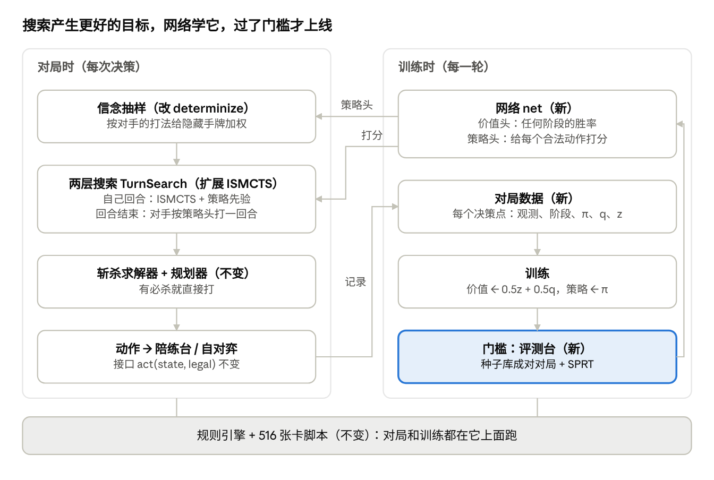

# 超凡世界 Bot 架构设计

2026-10-07 · 为 Salem 写，也给两个训练会话执行用。在线版（可评论）：https://claude.ai/code/artifact/90e16ede-e6e8-4035-8a63-b6df5dcf634c

## 结论

你的判断大体对，但要分开说：**模拟器的架构很好，决策（AI）的架构有一个结构性的天花板，实验方法又把很多迭代浪费在噪声里。** 这不是再多调几个参数能解决的。

- **模拟器不是问题。** 516 张卡全有脚本、828 项测试、4 万局模糊测试无失败、引擎确定可回放。唯一一次真正的提升（跳费龙内战 60%～71%）来自修一个评分 bug（焦灰徽记算成持有者加分），说明底层规则是可信的。
- **决策架构的天花板：** 搜索只看自己这一回合，回合一结束就交给一个线性评分（约 50～80 个手写特征相减）。所有跨回合的东西（留正义下回合配超进化、把解场手段留到对手威胁出现时）都只能靠这个评分"记住"，而它只在"自己回合刚结束"的局面上、用 bot 自己打出来的胜负训练过。你赢在步与步之间的配合，这正是这个结构表达不了的。
- **没有"变强"的闭环：** 自我对局学的是"现在这个 bot 打下去会赢吗"，不是"更好的打法是什么"。老师推演用的是同一个或更弱的 bot，所以教不出比自己强的学生（51%、55%）。对手永远是同一个固定版本，它的弱点没人惩罚。
- **评测太粗：** 大多数结论只打 100 局（±10%）。51%、55%、45%、46%、49% 在统计上都等于没变化，却各自花了一轮迭代。

**最先做的三件事：**

1. 建评测台：固定种子库、两边换座位成对打、序贯检验（SPRT），能分清 55% 和 50%。实测这台容器一局约 2 秒，800 局约 7 分钟，以前只打 100 局是习惯，不是算力限制。
2. 让评分在每个决策点都能用（回合中、回合开始、回合结束，带阶段标记），用搜索结果做自举目标训练。这一步解锁"搜索里推演对手回合"，以前那次 29/100 就是卡在这里。
3. 关上变强的闭环：搜索产生更好的目标（访问分布 + 搜索值），网络学它，新版本必须过评测台才上线，对手是历代版本组成的联赛，不再只打一个固定 bot。

## 现状：代码里实际是什么

读的是 test1 仓库 `ccr-165ad1e7-t2zmqu` 分支（最新提交 f9ad8d5，2026-10-07）。按数据流从前到后：

| 组件 | 代码 | 做什么 | 要注意的地方 |
| --- | --- | --- | --- |
| 规则引擎 | `core/engine.py`、`core/state.py`、`cards/*` | 完整规则、clone、确定性回放 | 单核约 170 局/秒（随机打），足够用 |
| 状态表示 | `learn/features.py` | 每边约 22 个总量特征（血量、场面攻防和、关键词个数、手牌数……），第二版再加 16 个"卡牌作用"特征 | 只是快照里的总量，看不到是哪张牌、看不到对手打过什么 |
| 隐藏信息 | `core/view.py` 的 `determinize` | 对手手牌从"没见过的牌"里**均匀**重抽 | 没有信念更新：对手留了什么、不打什么都不影响抽样 |
| 搜索 | `search/mcts.py` | ISMCTS，只搜自己这一回合的行动序列，结束回合就是叶子；取最大值回传，运气取平均 | 视野 = 1 回合。`reply=True` 时用贪心 bot 替对手打一回合，但评分不认识那种局面 |
| 评分 | `search/evaluate.py`、`learn/model.py` | 手设权重或逻辑回归（可选 16 个单元的隐藏层），按卡组 / 对局各一份 | 只用于"轮到对手行动"的局面；`player_moves_next` 参数对学习版直接忽略 |
| 训练 | `learn/data.py`、`learn/fit.py`、`tools/learn.py`、`tools/train_matchup.py` | 自对弈中每个"回合结束"局面记一行，标签 = 这局最后赢没赢；可加玩家选择的排序损失 | 标签是 bot 自己的胜负：学到的是"这个 bot 会不会赢"，不是"怎样更好"；2 轮就到顶 |
| 外挂规则 | `search/moves.py`、`agents/*`、`arena.make_agent` | 20 多个 `+` 后缀：plan、reserve、enhance、pace、dig、priced…… | 每个都是针对一个现象的补丁，组合爆炸，各自只测 100～200 局 |
| 评测 | `tools/arena.py` | 循环赛，换座位，报胜率 ± 95% 区间 | 局数由人定，没有停止规则和固定对手池 |
| 陪练台 | `ui/session.py`、`web/` | 三档：greedy / mcts:100 / mcts:200，都加 `+plan+learned`；网页版在浏览器里用 Pyodide 跑同一套 Python | 只通过 `make_agent(spec).act(state, legal)` 调 AI，接口干净，换核心不用动它 |

实测（本容器，4 核，跳费龙内战）：`greedy+plan+learned` 每局 1.4 秒，`mcts:100+plan+learned` 每局 2.0 秒、每步 42 毫秒，一局双方合计约 46 个决策。

## 诊断：哪些平台期是架构造成的

把两个会话报过的主要结果逐条归类。区间是按局数算的 95% 区间（近似），包含 50% 的就是"没测出变化"。

| 结果 | 局数 | 95% 区间 | 归类 | 为什么 |
| --- | --- | --- | --- | --- |
| Salem 跳费龙内战 10 战 10 胜 | 10 | Salem 的胜率 ≥ 69% | 真差距 | 唯一可靠的人类基准 |
| 修焦灰徽记评分 bug，对旧 bot | 72/120 | 51%～68% | 规则 / 评分 bug | 唯一一次实打实的提升 |
| 内战专用模型，对旧 bot | 113/160 | 63%～77% | 数据 | 不再把"龙打破魔虫"的对局混进来 |
| 模拟次数 ×5 | 100 | 53% | 架构 | 视野只有一回合，多搜只是更彻底地优化一把粗尺子 |
| 手调 16 个权重 | 各 600 | 42%～52% | 架构 | 线性加和已到局部最优 |
| 完整第二版特征 | 100 | 32% | 架构 | 一回合搜索学到"攒资源"，却没有用资源的后续计划 |
| 加一层隐藏层 | 100 | 22% | 架构 | 只在回合结束局面上学，搜索在回合中间打分时乱外推 |
| 搜索里推演对手回合 | 100 | 21%～39% | 架构 | 评分没见过"对手回合打完"的局面，对手又是贪心 bot |
| 让 bot 看到对手手牌 | 100 | 36%～56% | 架构（噪声内） | 没有任何组件会用这个信息 |
| 老师推演（贪心 / 搜索） | 100 / 100 | 41%～61% / 45%～65% | 闭环缺失 | 老师不比学生强 |
| 两回合计划 | 27/60 | 33%～58% | 噪声 | 还没打完，目前看不出任何东西 |
| 照 Salem 的出牌时间表、增幅等待 | 120 / 100 | 均含 50% | 噪声 | 外挂规则，没有效果 |
| 自我内战里起手好坏 51% 对 49% | | | 闭环缺失 | 双方都不会把资源变成胜势，也不惩罚对方浪费 |

结论有三层：

1. **架构卡住的（最重要）：** "一回合搜索 + 只在回合结束有效的线性评分"。上面五个明显变差的实验（32%、22%、29/100……）不是这些想法错了，而是它们都需要一个在任何时刻都能打分、懂得对手会回应的评分，而现在没有。两回合计划、看对手手牌、推演对手都是对的方向，是装在了接不住它们的底座上。
2. **训练方法卡住的：** 标签来自 bot 自己的胜负、只和一个固定版本打，所以每次"重训"一两轮就到顶。这是训练会话自己说的"惩罚不了自己的毛病"。
3. **噪声和 bug：** 一半左右的"没效果"结论其实是"没测准"。而真正的提升来自修 bug 和分对局训练，不是新算法。说明还可能有别的评分 bug 藏着，值得系统地找。

反过来说，有些东西不该推倒：ISMCTS 本身（确定化 + 可用次数 UCB + 取最大值回传）是合理的选择，斩杀求解器和资源流规划器也很有价值，可以直接留用。

## 目标架构

思路是一个"小号 AlphaZero"：保留引擎、ISMCTS、斩杀求解器，把评分换成一个在任何时刻都有效的小网络，给搜索加上对手回合，再用搜索的结果一轮轮教网络。不推荐纯 PPO 强化学习：算力不够，而且战术很难练出来。

左边是每次出牌时发生的事，右边是每轮训练。右侧的箭头从门槛绕回网络：只有过了门槛的新网络才替换旧的，这一条就是现在缺的闭环。

### 组件和接口

1. **观测编码 `encode(state, me) -> Obs`**（新）。只用 `me` 看得到的信息：
    - 每张可见的牌一个向量（卡号嵌入 16 维 + 费用、攻防、关键词、进化、倒数），分区：我的手牌、双方战场、双方主战者区。用池化（求和 / 最大值）把每个区压成定长向量，不用注意力层，保持小。
    - 公开历史：对手打过的牌、还没见过的牌（记牌）各一个"卡号计数"向量。
    - 全局：回合数、PP、进化点、先后手，以及**阶段标记**（我的回合中 / 我的回合刚结束 / 我的回合开始）。
    - 现有的第二版手写特征（卡牌作用、能撑几回合、场面威胁、规划器估的下回合伤害）作为额外输入保留：数据少时它们是很好的先验。
2. **网络 `net(Obs) -> (value, policy_logits)`**（新）。共享主干（2 层 128 单元），两个头：
    - 价值头：当前行动方的胜率，**在任何决策点都有效**。
    - 策略头：对合法行动打分。行动按现在的 `action_key`（类型、来源牌、目标）编码成向量，和主干输出点积，不需要固定动作空间。
    - 用 PyTorch 训练，导出成 `.npz`，推理只用 numpy（网页版 Pyodide 自带 numpy）。
3. **信念抽样 `sample_world(state, me, history, net) -> GameState`**（改 `determinize`）。先用现在的均匀重抽生成候选，再按"对手在这手牌下做出实际打法的可能性"加权重采样（对手的换牌和每步选择用策略头评）。第一版可以只用两条规则：换牌留下的牌更可能还在手里，一直有费不打的牌更可能不在手里。
4. **两层搜索 `TurnSearch`**（扩展 `ISMCTS`）：
    - 自己回合：和现在一样的 ISMCTS，只是展开顺序和 UCB 里加上策略头的先验（PUCT）。
    - 结束回合的叶子：用策略头当对手，在抽出的世界里替对手打完一回合（每步取概率最高或抽样，带斩杀检测），在"我的回合开始"用价值头打分。
    - 省时间的办法：只对访问次数最多的几个结束回合叶子做对手推演，其余直接用"回合结束"阶段的价值头。训练会让这两种打分一致。
    - 斩杀求解器和资源流规划器照旧包在外面，必杀直接打。
5. **智能体接口不变**：`act(state, legal) -> action`。新 bot 在 `make_agent` 里叫 `az:N`（N = 每步模拟次数），陪练台只改 `LEVELS` 一行。
6. **外挂规则逐步退役**：`+reserve`、`+enhance`、`+pace` 这类补丁不进新 bot。如果新 bot 还犯同样的错，先查是不是评分 / 规则 bug，再考虑加回去，且必须过评测台。

## 训练循环和评测协议

每一轮都是"生成对局 → 训练 → 门槛 → 上线"，只有过了门槛的版本才能成为下一轮的对手和陪练台的 bot。先只做跳费龙内战一个对局：那里有 Salem 的 10 局基准，数据也不会混。

### 一轮训练

1. **生成对局**：当前最强版本用 `az:N` 打 2000 局。80% 和自己打，20% 和对手池里的其他版本打（前三个最强版本、现在装着的 `mcts:200+plan+learned`）。前 30 步按访问次数抽样选动作（增加多样性），之后取最多的。
2. **每个决策点记一行**（不只是回合结束）：观测、阶段标记、合法动作、搜索的访问分布 π、搜索给的值 q，对局结束后补上胜负 z。每个"回合结束"点再配一个"对手回合推演后的值"，用来教价值头两种打分一致。
3. **训练**：价值目标 = 0.5·z + 0.5·q（纯 z 噪声太大，纯 q 会自我强化偏差）；策略目标 = π（交叉熵）。用最近 5 轮的数据，按对局划出 10% 做验证。Salem 的对局可以用很小的权重加到策略目标里，但不进价值目标（第二版特征的教训：学 Salem 的选择反而变弱）。
4. **门槛**：新版本对当前最强版本跑序贯检验（见下），通过才升级；另外对装着的旧 bot 至少 400 局不倒退。

算力估计（按实测 mcts:100 一局 2 秒推算，加对手推演和网络推理按 2～3 倍算，是推断不是实测）：一局 4～6 秒，4 核并行 2000 局约 35～50 分钟，小网络在 CPU 上训练几分钟。一晚上能跑 6～8 轮。

### 评测协议

- **种子库**：固定 2000 个开局种子，每个种子两边换座位各打一局（成对），把发牌运气抵消掉。所有对比都从同一批种子开始。
- **样本量**：要把 55% 和 50% 分开（单侧 5% 显著、功效 80%）约需 620 局；双侧约 780 局。60% 对 50% 约 200 局。100 局只能看出 65% 以上的差距。
- **序贯检验（SPRT）**：像国际象棋引擎的测试那样，边打边算似然比，H0 = 没变化（0 Elo），H1 = 55%（约 +35 Elo），α = β = 0.05，上限 2000 局。大差距几百局就停，没差距也会自动判"没用"，不用人拍局数。
- **一张 Elo 表**：所有版本和对照 bot（random、greedy、装着的旧 bot）放在同一张表上，带区间，写进仓库。
- **人类基准**：Salem 对每个上线版本的战绩单独记，用 Beta 分布给区间。10 局只能读出大差距，所以它是长期指标，不是每轮门槛。长期目标：Salem 对 bot 的胜率从 ≥ 69% 降到 60% 以下。
- **代理指标只做诊断**：价值头按阶段的 AUC、策略头对 Salem 每一步的命中率都报，但不决定上不上线。以前已经有过 AUC 0.761、实战 32% 的例子。

## 分阶段迁移

每一阶段结束时陪练台都能用：新 bot 只在过了门槛后作为新档位加进 `LEVELS`，旧档位保留到新的稳定为止。每阶段的"门槛"是下一阶段开始的条件。

1. **阶段 0：评测台（最先做，不动 AI）**
    - 新增 `tools/gate.py`：种子库、成对对局、SPRT、Elo 表。
    - 用它重测常用的几个后缀（`+plan`、`+learned`、`+reserve`、`+enhance`、`mcts:100` 对 `mcts:200`），没有显著收益的不进新 bot。
    - 顺手做"评分 bug 普查"：像焦灰徽记那样，在沙盒里量每个纹章、护符、倒数效果对双方的真实影响，和评分的符号对照。这是已知唯一产生过真实提升的方向。
    - 门槛：评测台能在 2000 局内对一个已知 60% 的差距（修徽记 bug 前后）稳定判出显著。
2. **阶段 1：全阶段价值 + 对手回合推演**
    - 新增 `learn/encode.py`（观测编码）和 `learn/net.py`（numpy 推理），先只用价值头。
    - 改 `learn/data.py`：每个决策点都记录，带阶段标记。数据先用现在装着的 bot 自对弈生成。
    - 用它替换 `Learned`，重开 `mcts-reply`（对手先用贪心 bot）。
    - 门槛：`mcts-reply` + 新价值 对装着的 bot SPRT 通过。这一步就是对"架构是瓶颈"的直接检验：如果还是不赢，说明瓶颈不在这里，要回头查。
3. **阶段 2：策略头 + 对手模型**
    - 策略头先蒸馏现在 bot 的搜索访问分布，用于三处：搜索的先验（PUCT）、推演里的对手（替换贪心）、信念抽样的加权。
    - 门槛：加了策略头的 `az:N` 对阶段 1 的 bot SPRT 通过。
4. **阶段 3：闭环迭代 + 对手池**
    - 跑上一节的训练循环，每轮门槛自动判。加一个"专门打当前最强版本的对手"（只和它打、只学怎么赢它），把它的弱点暴露出来。
    - 门槛：连续三轮都能升级，且 Salem 对新版本的胜率明显下降。
5. **阶段 4：推广到其他对局**
    - 同一个网络加"我方 / 对方卡组"输入，或者每个对局一个头；先破魔虫对跳费龙。
    - 网页版：如果 Pyodide 里 `az:N` 太慢，"快"档可以直接用策略头出牌（不搜索）。

仓库约定：新代码放在新文件里，旧 bot 和所有 `+` 后缀保持可用；训练出的权重和 Elo 表都提交，每个上线版本有编号。

## 取舍和风险

| 选择 | 好处 | 代价 / 风险 | 建议 |
| --- | --- | --- | --- |
| 小网络替换线性评分 | 能表达"大随从在对手没解场时更值钱"这种交互 | 要更多数据；以前加隐藏层跌到 22% | 先解决全阶段数据（那次失败的原因），保留手写特征做输入 |
| 搜索加对手回合 | 直接看到"对手下回合会怎么回应" | 每步用时以前测过 65 → 481 毫秒 | 只对访问最多的几个叶子推演；网页版可用蒸馏版 |
| 信念加权抽样 | 用上"对手一直不打某张牌"这类信息 | 实现复杂；看到真实手牌以前也没帮助 | 放在阶段 2 之后：没有对手推演，信念再准也没用 |
| 只做跳费龙内战 | 有人类基准、数据干净 | 破魔虫要等 | 先证明框架有效，再推广 |
| 纯 PPO 强化学习 | 不需要搜索 | 样本效率低，战术弱（SWB-RL 的经验） | 不做 |
| 继续加 `+` 后缀 | 每个都快 | 组合爆炸，大多测不出效果 | 停止，除非过了评测台 |

**最先做什么：** 阶段 0 和阶段 1。阶段 0 代价小、立刻让之后每一轮都不白跑；阶段 1 是对这份诊断最便宜的检验，如果"全阶段价值 + 对手推演"能过门槛，就证明瓶颈确实在架构，后面的闭环值得投入。

**没能确认的：** Salem 自己的电脑有没有显卡。有的话训练放在那边更快，但对局生成仍然是 CPU 跑 Python 引擎，核数比显卡更重要。上面的时间都按这台 4 核容器估算。
